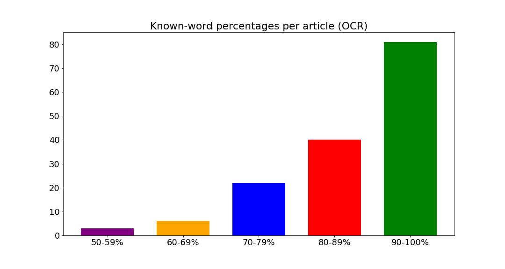
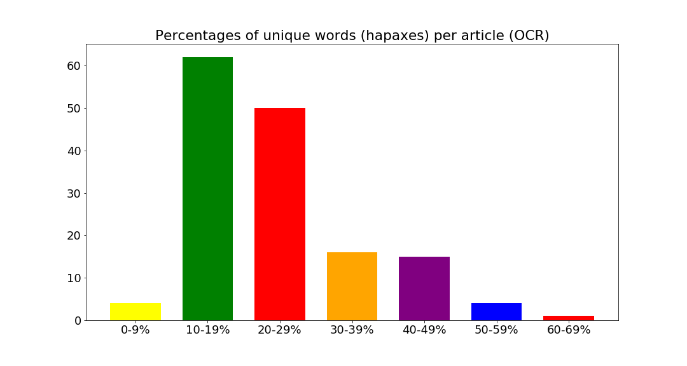
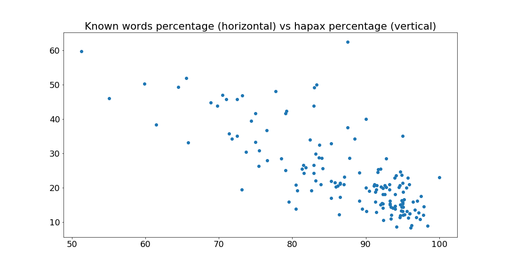

# Evaluation of OCR quality of Dutch text

Erik Tjong Kim Sang<br>Netherlands eScience Center

This directory contains the software developed for the evaluation
of the OCR quality of Dutch text. This work is part of the eScience
project [TICCLAT](https://www.esciencecenter.nl/project/ticclat).
This subtask was executed in the team sprint of 26-29 November 2018.

## Evaluation with gold standard data

The most reliable evaluation method requires the availability of
gold standard data, to enable an elaborate comparison between 
the OCR text with errors and the correct gold standard. We 
examined two strategies. The first involved 
[BLEU](https://en.wikipedia.org/wiki/BLEU), a method widely used
for evaluating machine translation results. It compared word 
ngrams in two texts. It requires that the two texts are 
sentence-aligned. In our case this means that every line in the 
texts contains a single sentence and that sentences at the same
line position belong with each other:

```sh
$ perl bleu.pl data/a0001-gold.txt data/a0001-ocr.txt
processed 3 sentences; bleu score = 0.55377
```

BLEU produces a single score between 0 and 1. Score zero indicates 
that the texts are completely different on word level. Score one
indicates that the two text are identical. The BLEU script 
originates from the [CLIN27 Shared Task](https://ifarm.nl/clin2017st/) 
(Tjong Kim Sang, et al. 2017).

The second evaluation strategy used concerned the OCR evaluation
tool [ocrevalUAtion](https://github.com/impactcentre/ocrevalUAtion).
We downloaded the version of NLPPLN: [ocrevaluation-docker](https://github.com/nlppln/ocrevaluation-docker)
from Github and expanded the default run script run.py (to be added). Next
we applied the script as follows:

```sh
$ cwl-runner run.cwl --gt data/a0001-gold.txt data/a0001-ocr.txt
$ grep '[WC]ER' a0001_out.html | sed 's/<[^<>]*>/ /g'
CER  9.33 
WER  25.19 
WER (order independent)  23.70 
```

The program reports character error rates (CER) and word error
rates (WER)

## Evaluation without gold standard data

Often there is no gold standard data available for checking the 
quality of the text. For this scenario we examined two strategies.
First, we explored using a lexicon to check how many known words 
the OCR texts contain. Like Van Erp et al. (2018), we employed 
the [IMPACT lexicons for Dutch words and Dutch names](https://www.digitisation.eu/tools-resources/language-resources/historical-and-named-entities-lexica-of-dutch/):

```sh
$ python3 knownWords.py data/a0001-ocr.txt
data/a0001-ocr.txt: Known tokens: Case sensitive: 76.8% Case insensitive: 80.5%
```

(knownWords.py requires the Python package nltk to run)
The program presents two variants of the percentage of tokens in 
each text that are present in the two lexicons: a case-sensitive
count and a case-insensitive count. Only tokens that contain an
alphabetic character (a-zA-Z), are considered for these counts.

The next strategy consisted of counting the number of unique 
tokens each text contains. Most texts contain many unique words
(called hapaxes) so this strategy works best if it is applied to
a collection of texts. Whether a word is unique or not will then
be determined with respect to the whole collection:

```sh
$ python3 hapaxCount.py data/a0001-ocr.txt data/a0003-ocr.txt 
data/a0001-ocr.txt: Number of words: 134; Hapaxes: 57.4%; Lower Case Hapaxes: 51.4%
data/a0003-ocr.txt: Number of words: 159; Hapaxes: 60.3%; Lower Case Hapaxes: 50.9%
```

(hapaxCount.py requires the Python package nltk to run) 
The program reports two percentages of unique words (hapaxes):
one that uses case-sensitive comparison and one that uses
case-insensitive comparison.

With the Jupyter notebook visualizeScores.ipynb we created data
visualizations for these two strategies applied to articles from
one issue of the De Volkskrant newspaper (2 January 1965). The 
correlation factor between the two measures was -0.76.

  

## References

Marieke van Erp, Melvin Wevers and Hugo Huurdeman, [Constructing a Recipe Web from Historical Newspapers](https://github.com/DHLab-nl/historical-recipe-web/blob/master/constructing-recipe-web-2.pdf). In: "Proceedings of the International Semantic Web Conference - ISWC 2018", Springer Verlag, pages 217-232, 2018.

Erik Tjong Kim Sang, Marcel Bollmann, Remko Boschker, Francisco Casacuberta, Feike Dietz, Stefanie Dipper, Miguel Domingo, Rob van der Goot, Marjo van Koppen, Nikola Ljubešiç, Robert Östling, Florian Petran, Eva Pettersson, Yves Scherrer, Marijn Schraagen, Leen Sevens, Jörg Tiedemann, Tom Vanallemeersch and Kalliopi Zervanou, [The CLIN27 Shared Task: Translating Historical Text to Contemporary Language for Improving Automatic Linguistic Annotation](http://clinjournal.org/sites/clinjournal.org/files/04.clin27-shared-task.pdf). In: Computational Linguistics in the Netherlands Journal, volume 7, pages 53-64, 2017, ISSN 2211-4009.
